# Adobe Acrobat Sign Connector

[Adobe Sign](https://www.adobe.com/sign.html) is a cloud-based electronic signature service that enables users to send, sign, track, and manage signature workflows digitally. With the Adobe Acrobat Sign Connector, you can integrate these functions conveniently and straightforwardly into your Axon Ivy processes.

This connector:
- provides open source code so you can easily integrate Adobe Acrobat Sign into your Axon Ivy implementations
- authenticates with OAuth2 or an integration key
- allows you to upload PDF(s) that are signed by one or several persons
  
## Demo

The demo project can be used to test the authentication and signing and the demo implementation can be used as inspiration for development.

### How to sign a document in the Demo application
:exclamation: The demo will work only after correct setup of the connector (check tab "Setup")
 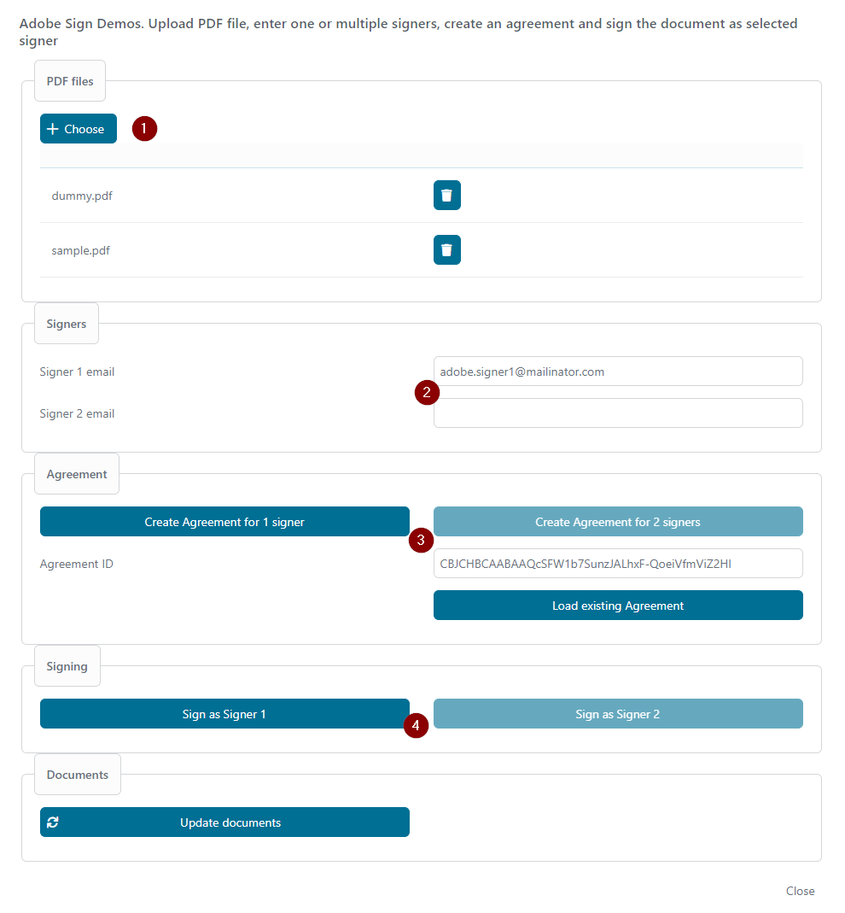
 1. Choose and upload one or more PDF files
 2. Enter email of 1 or 2 signers
 3. Obtain agreement for the signers
 4. Sign as signer 1 and (if configured) signer 2
 5. A dialog box with the Adobe signature page opens. Create a signature in the document. If several documents have been sent for signing, they are all displayed here and can be signed in one step.

 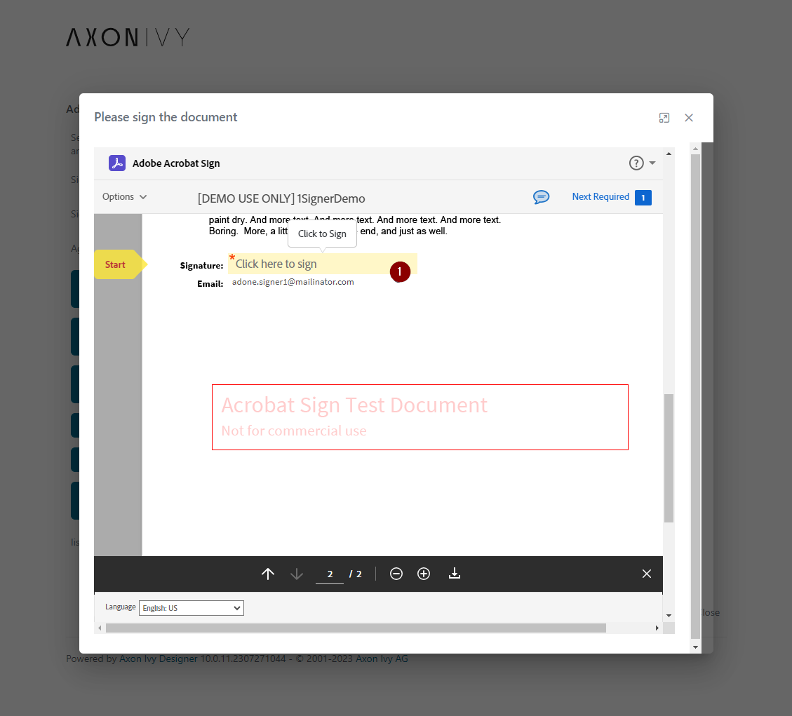

 7. Confirm the signature with **Click to Sign**.

 

 7. The signed documents can be downloaded separately or as a combined document.

 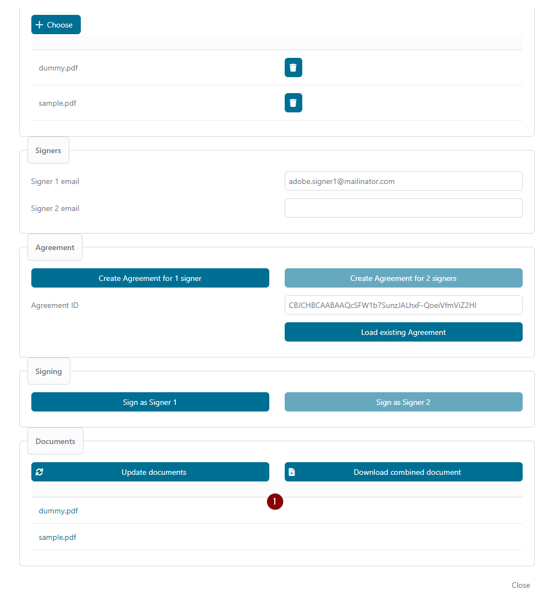

## Setup

### Adobe Sign account creation

	An Adobe Sign account needs to be created to setup and use the connector.

  1. Create a **AdobeSign** Company **Account** OR for Developer Account creation use [Create Developer Account, APIs for custom applications | Acrobat Sign](https://www.adobe.com/sign/developer-form.html) and follow these steps:

 	 a. Fill in the form with personal and business data + continue
 	 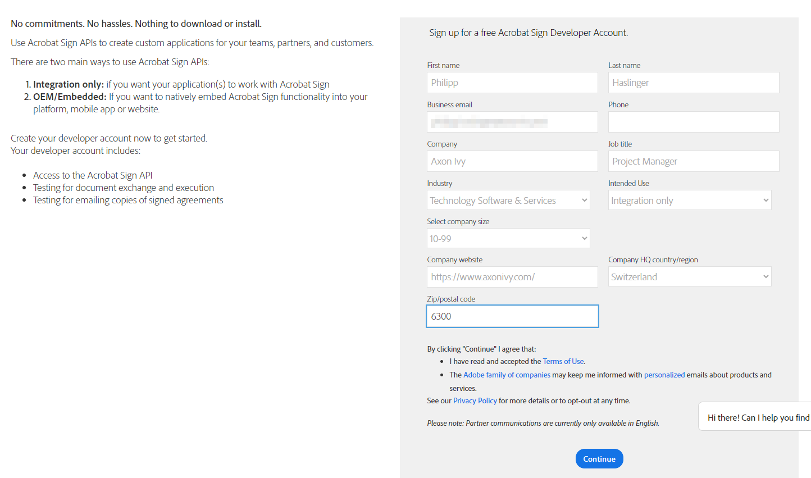

 	 b. Provide a password + continue
 	 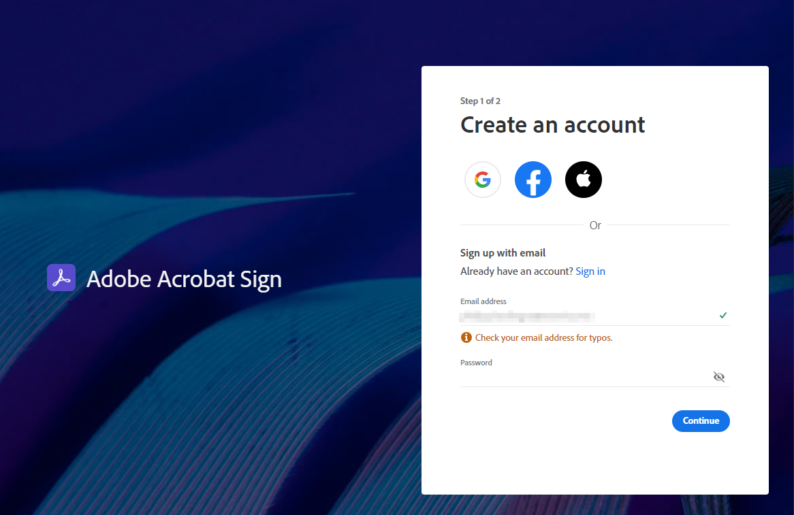

 	 c. Provide date of birth + continue
 	 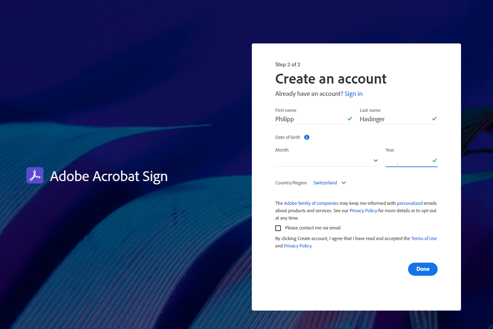

 	 d. You will then receive a verification code. Enter the code and the process will continue automatically
 	 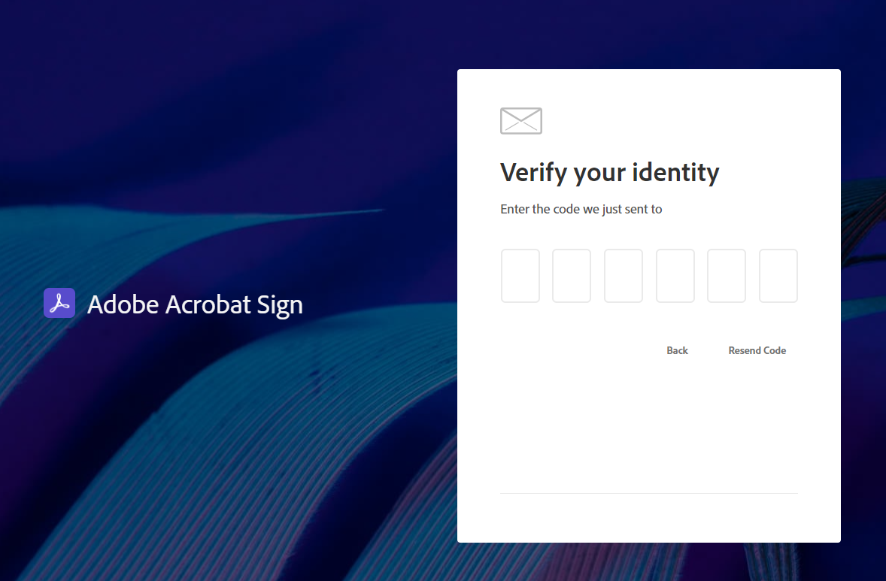

 	 e. Developer account is created
 	 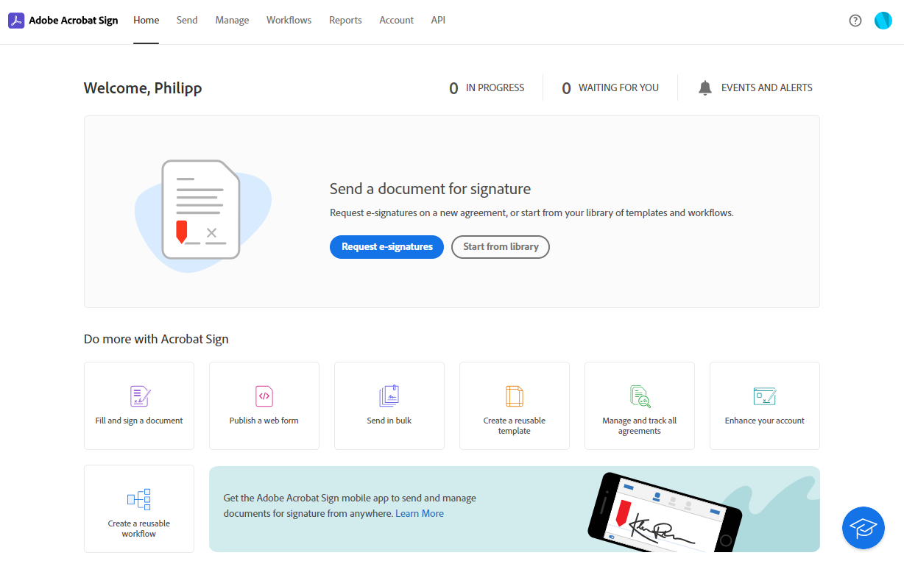

Adobe Sign provides 2 options for authentication. (See Setup section)

 1. Integration Key
 2. OAuth2

To setup and use the Adobe Sign Connector it needs to be connected with Adobe. An Adobe administration account needs to be created. (See Adobe Sign account creation)

### Admin Setup Page
Adobe Sign Connector provides a setup page for easy setup of the connector and setup of the authentication.
To be able to open the admin setup page the admin user needs to own `ADOBE_ESIGN_ADMIN` role which is part of the connector.
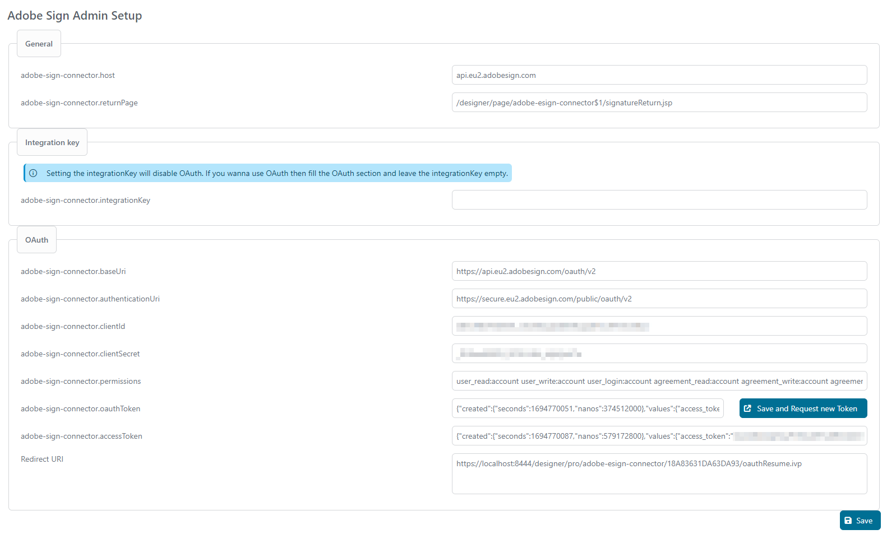

#### General
| Variable name | Description |
|--|--|
| adobeAcrobatSignConnector.host | hostname of Adobe Sign server |
| adobeAcrobatSignConnector.returnPage | relative part of URL that is called after singing was finished |

#### Integration Key
:exclamation: If the integration key is set, OAuth is deactivated for the connector. If you want to use OAuth for the connector, leave the integration key empty :exclamation:
| Variable name | Description |
|--|--|
| adobeAcrobatSignConnector.integrationKey | Integration key from Adobe Sign configuration |

##### How to get an Integration Key

 1. Go to your Adobe Sign account page: https://secure.adobesign.com/account/
 2. Open **Access Tokens** configuration
 
 3. Create new integration key
 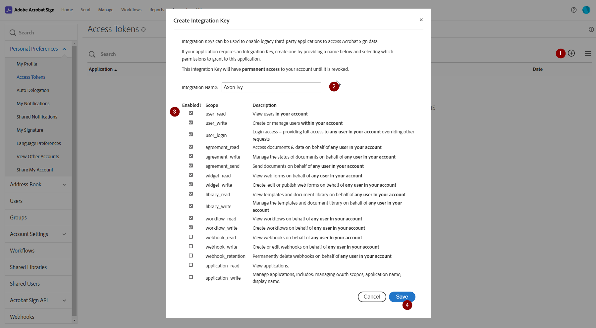
 4. Copy the integration key to the admin setup page
 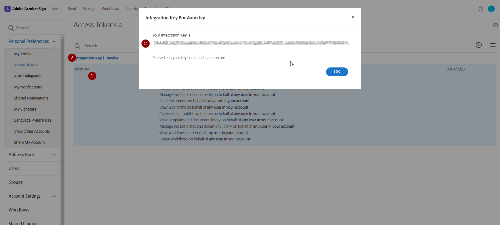

#### Oauth
Adobe API doc references for OAuth
 1. https://secure.adobesign.com/public/static/oauthDoc.jsp
 2. https://opensource.adobe.com/acrobat-sign/developer_guide/oauth.html

##### OAuth API Application setup
An API Application needs to be setup at Adobe Sign admin account before OAuth can be configured in the connector.
 1. Go to your Adobe Sign account page: https://secure.adobesign.com/account/
 2. Go to **API Applications** configuration
 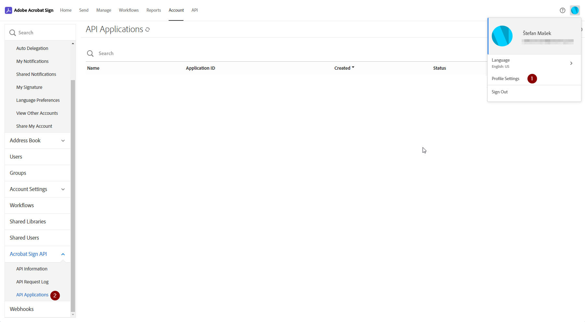
 3. Create new API Application. Set the Name, Display Name and Domain
 
 4. Open the newly created Application and copy ID and Secret to the connector's Admin Setup page
	 a. Application ID = `adobeAcrobatSignConnector.clientId`
	 b. Client Secret = `adobeAcrobatSignConnector.clientSecret`
	 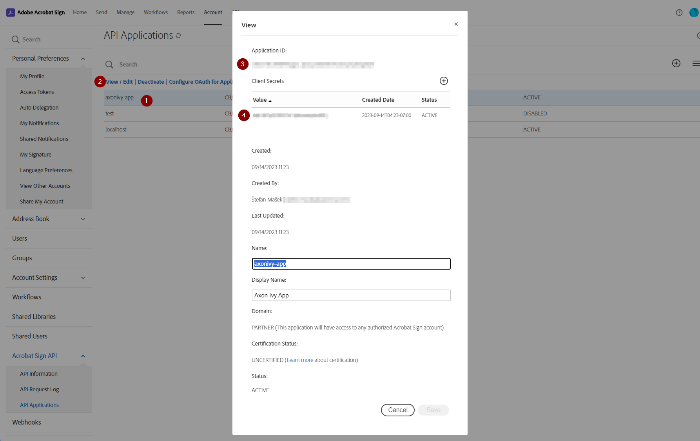
5. Open **Configure OAuth for Application** for your application
	a. Copy **Redirect URI** from connector's Admin Setup Page and paste it to the Application Configuration
	b. Enable persmissions that can be requested from this Application
	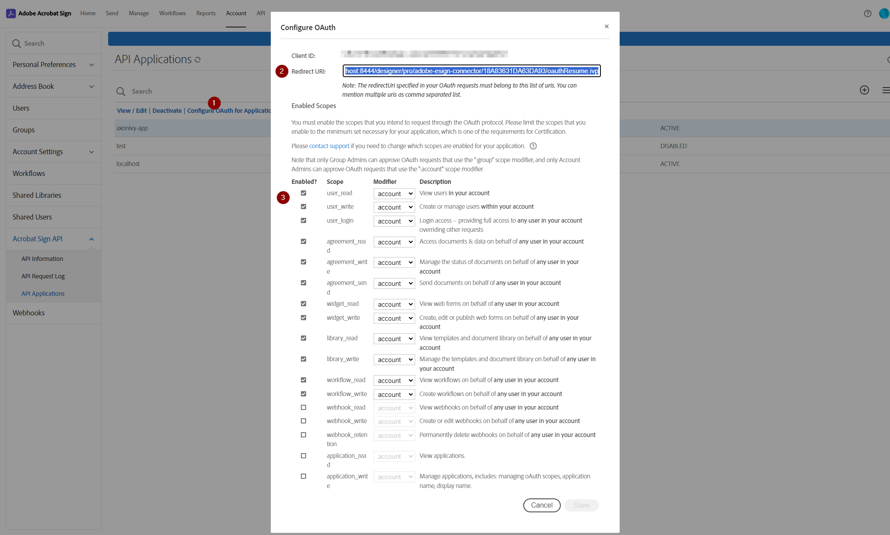

##### Variables and Admin Setup page for OAuth description
| Variable name | Description | Example
|--|--|--|
| adobeAcrobatSignConnector.baseUri | Base URI for getting the access and refresh access tokens (without the `/token` or `/refresh` part) | `https://api.eu2.adobesign.com/oauth/v2`
| adobeAcrobatSignConnector.authenticationUri| URL for the Authorization request (:exclamation:differs from tokens URL)| `https://secure.eu2.adobesign.com/public/oauth/v2`
| adobeAcrobatSignConnector.clientId| Adobe API Application Client ID|
| adobeAcrobatSignConnector.clientSecret| Adobe API Application Client Secret |
| adobeAcrobatSignConnector.permissions | List of permissions that will be requested for the OAuth token | `user_read:account user_write:account user_login:account agreement_read:account agreement_write:account agreement_send:account widget_read:account widget_write:account library_read:account library_write:account workflow_read:account workflow_write:account`
| adobeAcrobatSignConnector.oauthToken | Info about the OAuth refresh token. Empty means there is no token initialized. To request a new token use the `Save and Request new Token` button |
| adobeAcrobatSignConnector.accessToken| Info about the OAuth access token. |
| Redirect URI | This URI just needs to be setup to the API Application at Adobe Sign account page. (see **OAuth API Application setup** section)| `https://localhost:8444/designer/pro/adobe-acrobat-sign-connector/18A83631DA63DA93/oauthResume.ivp`

##### Requesting OAuth token
:exclamation::exclamation::exclamation: Please configure all the Variables in OAuth section on the Admin Setup page (see previous section) as they are necessary for requesting the token.

 1. Click the `Save and Request new Token` button. You will be redirected to Adobe Sign login page if the configuration of the Variables is correct.

2. Login with your Adobe Sign account
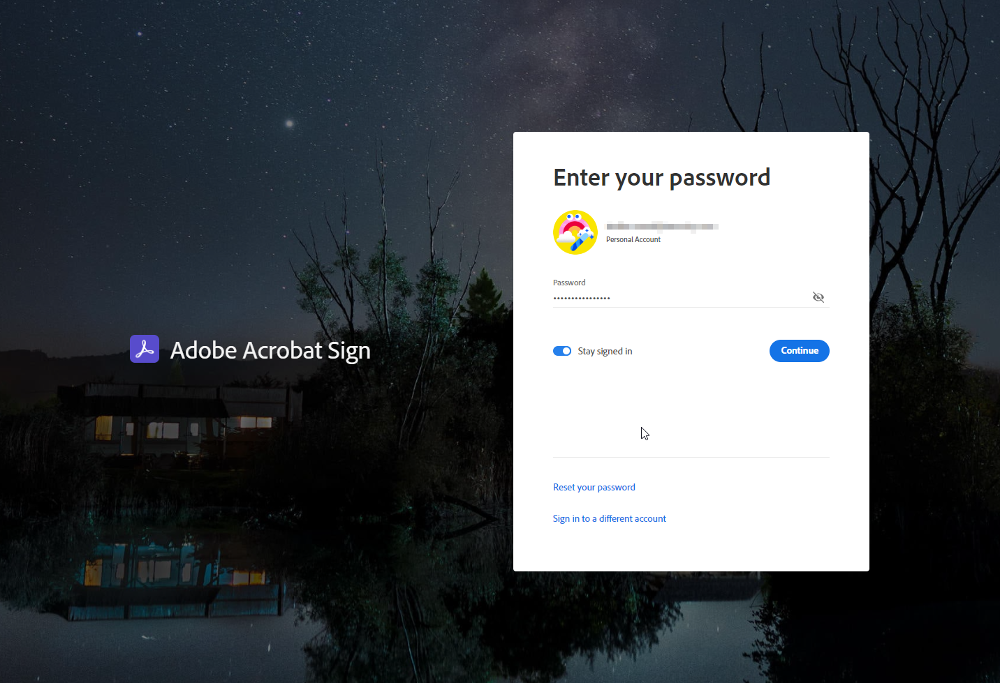
3. After successful login you should see all the requested permissions. Click **Allow Access**.
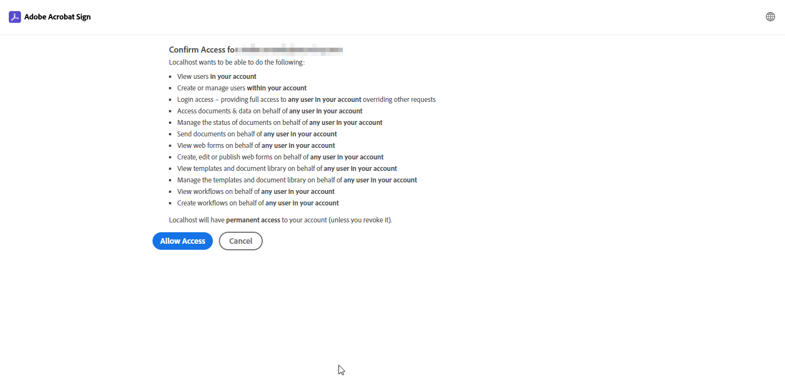
4. The token will be retrieved and you should be redirected back to the connector's Admin Setup page and should be able to see the initialized token.
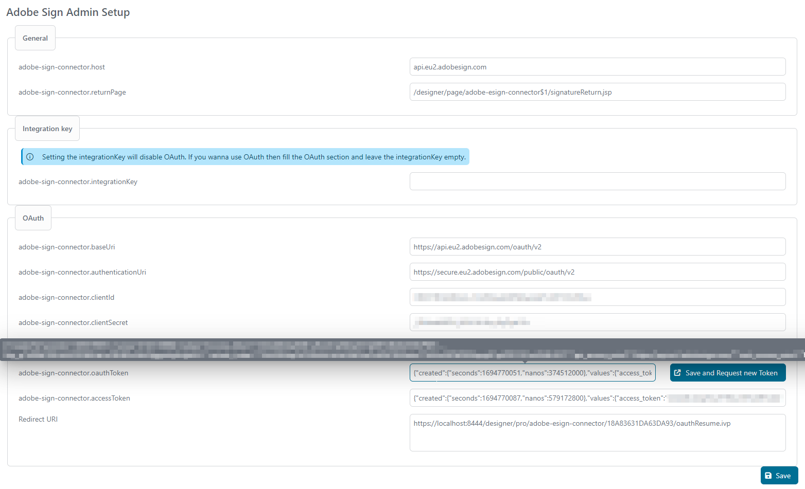

> [!NOTE]
> The variable path `adobe-acrobat-sign-connector` is renamed to `adobeAcrobatSignConnector` from 13.