# Adobe Acrobat Sign Konnektor

[Adobe Sign](https://www.adobe.com/sign.html) ist ein cloudbasierter Dienst für
elektronische Signaturen, mit dem Benutzer Signatur-Workflows digital versenden,
unterzeichnen, verfolgen und verwalten können. Mit dem Adobe Acrobat Sign
Connector kannst Du diese Funktionen bequem und unkompliziert in Deine Axon
Ivy-Prozesse integrieren.

Dieser Konnektor:
- bietet Open-Source-Code, damit Du Adobe Acrobat Sign ganz einfach in Deine
  Axon Ivy-Implementierungen integrieren kannst.
- Authentifiziert sich mit OAuth2 oder einem Integrationsschlüssel.
- ermöglicht Dir den Upload von PDF-Dateien, die von einer oder mehreren
  Personen signiert sind.

## Demo

Das Demo-Projekt eignet sich zum Testen von Authentifizierung und Signierung und
kann als Grundlage bzw. Inspiration für die eigene Implementierung genutzt
werden.

### So signierst Du ein Dokument in der Demo-Anwendung
:exclamation: Die Demo funktioniert nur nach vollständiger Einrichtung des
Konnektors (siehe Tab „Setup”) 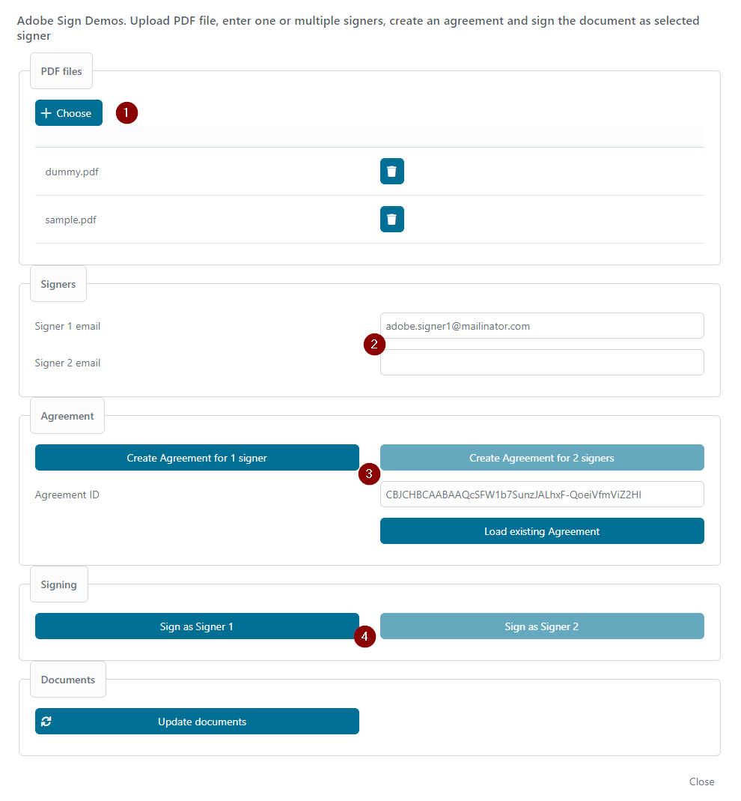
 1. Wähle eine oder mehrere PDF-Dateien zum Hochladen aus.
 2. Gebe die E-Mail-Adresse von 1 oder 2 Nutzern ein, die das Dokument signieren
    sollen.
 3. Einverständnis der Unterzeichner einholen
 4. Unterschreibe als Unterzeichner 1 und (falls konfiguriert) Unterzeichner 2.
 5. Es öffnet sich ein Dialogfeld mit der Adobe-Signaturseite. Erstelle eine
    Signatur im Dokument. Wenn mehrere Dokumente zum Signieren gesendet wurden,
    werden sie alle hier angezeigt und können in einem Schritt signiert werden.

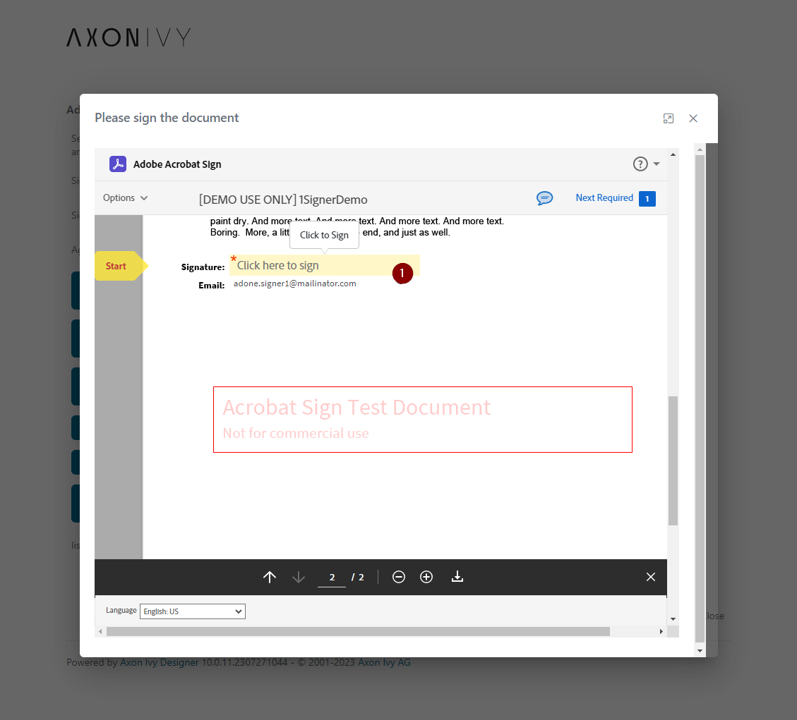

 7. Bestätige die Signatur mit „ **“ Klicke auf „Sign** “.

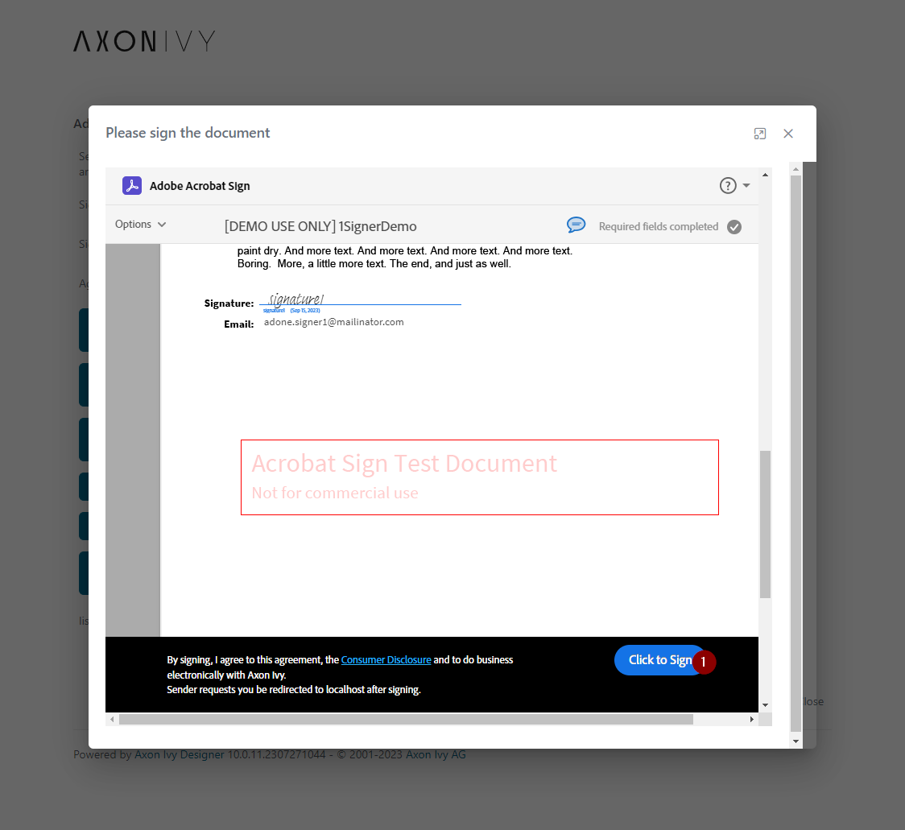

 7. Die unterschriebenen Dokumente können separat oder als ein gemergedtes
    Dokument heruntergeladen werden.

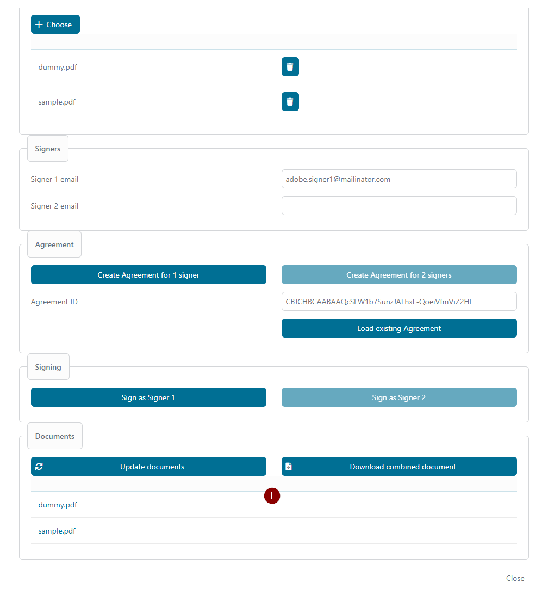

## Setup

### Erstellung eines Adobe Sign-Kontos

    An Adobe Sign account needs to be created to setup and use the connector.

  1. Erstelle ein **AdobeSign-** -Unternehmens **-Konto** ODER verwende zur
     Erstellung eines Entwicklerkontos [Entwicklerkonto erstellen, APIs für
     benutzerdefinierte Anwendungen | Acrobat
     Sign](https://www.adobe.com/sign/developer-form.html) und führe die
     folgenden Schritte aus:

     a. Fülle das Formular mit Deinen persönlichen und geschäftlichen Daten aus
     + weiter 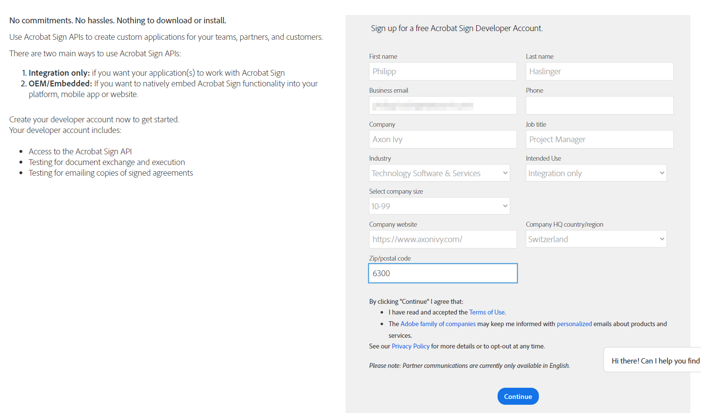

     b. Gib ein Passwort ein + weiter
     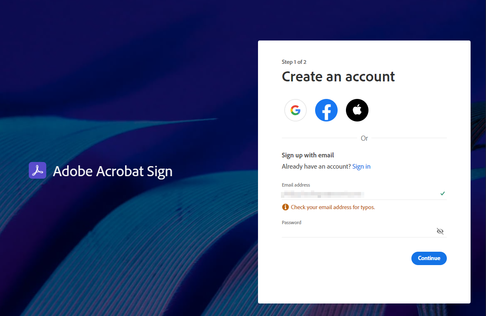

     c. Geburtsdatum angeben + fortfahren
     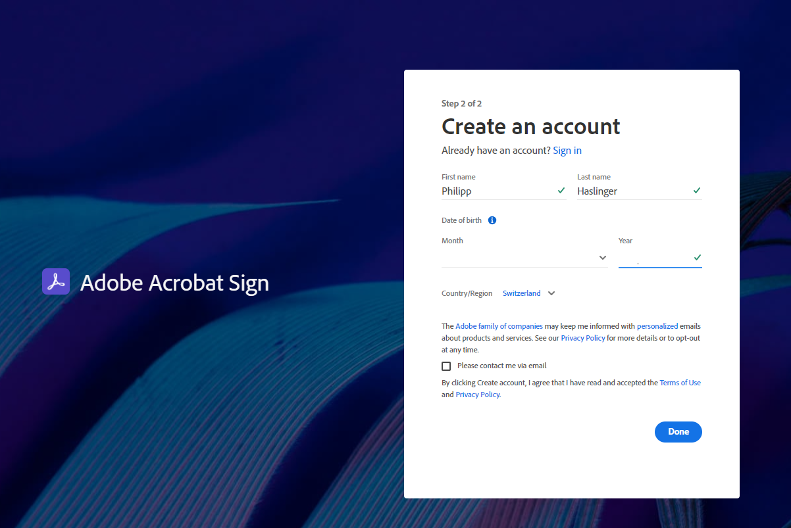

     d. Du erhälst einen Bestätigungscode. Gib den Code ein, und der Vorgang
     wird automatisch fortgesetzt.
     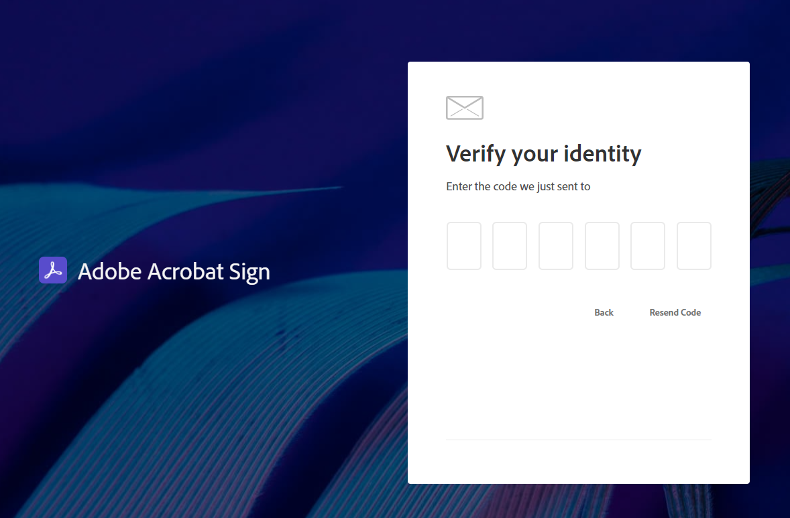

     e. Entwicklerkonto wurde erstellt
     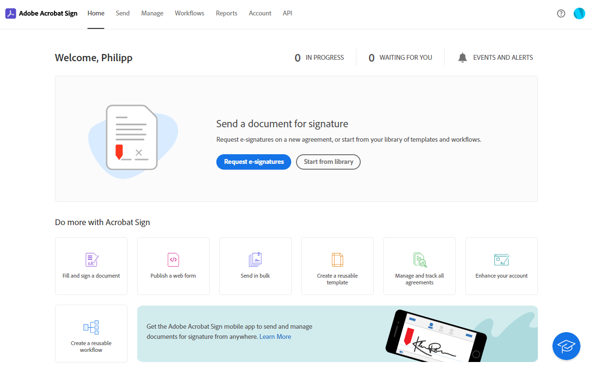

Adobe Sign bietet zwei Optionen für die Authentifizierung. (Siehe Abschnitt
„Setup“)

 1. Integrationsschlüssel
 2. OAuth2

Um den Adobe Sign Connector einzurichten und zu verwenden, muss er mit Adobe
verbunden werden. Dazu muss ein Adobe-Administratorkonto erstellt werden. (Siehe
Adobe Sign-Kontoerstellung)

### Admin Setup Seite
Adobe Sign Konnektor bietet eine Setupseite für die einfache Einrichtung des
Konnektors und das Setup der Authentifizierung. Um das Admin-Setup öffnen zu
können, muss der Benutzer über die Rolle `ADOBE_ESIGN_ADMIN` verfügen, die Teil
des Konnektors ist. 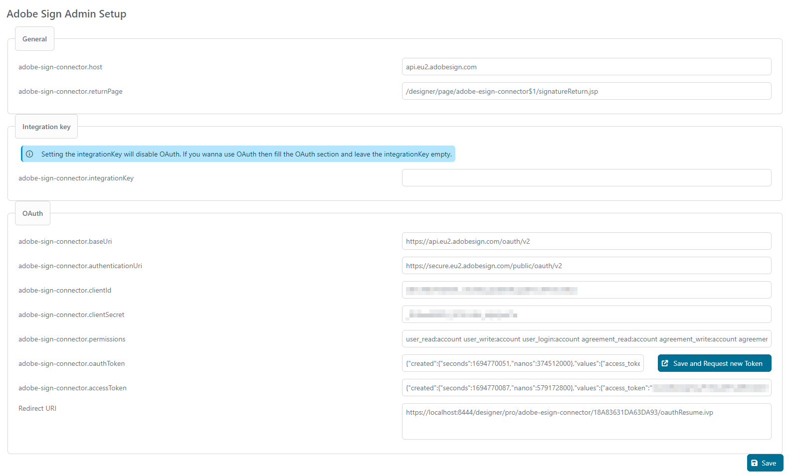

#### Allgemein
| Variablen Name                       | Beschreibung                                                              |
| ------------------------------------ | ------------------------------------------------------------------------- |
| adobeAcrobatSignConnector.host       | Hostname des Adobe Sign-Servers                                           |
| adobeAcrobatSignConnector.returnPage | Relativer Teil der URL, der nach Abschluss des Signierens aufgerufen wird |

#### Integrationsschlüssel
:exclamation: Wenn der Integrationsschlüssel gesetzt ist, wird OAuth für den
Konnektor deaktiviert. Wenn Du OAuth für den Konnektor verwenden möchten, lass
das Feld für den Integrationsschlüssel leer :exclamation:
| Variablen Name                           | Beschreibung                                           |
| ---------------------------------------- | ------------------------------------------------------ |
| adobeAcrobatSignConnector.integrationKey | Integrationsschlüssel aus der Adobe Sign-Konfiguration |

##### So erhälst Du einen Integrationsschlüssel

 1. Geh zu Ihrer Adobe Sign-Kontoseite: https://secure.adobesign.com/account/
 2. Öffne **Zugriffstoken** Konfiguration
    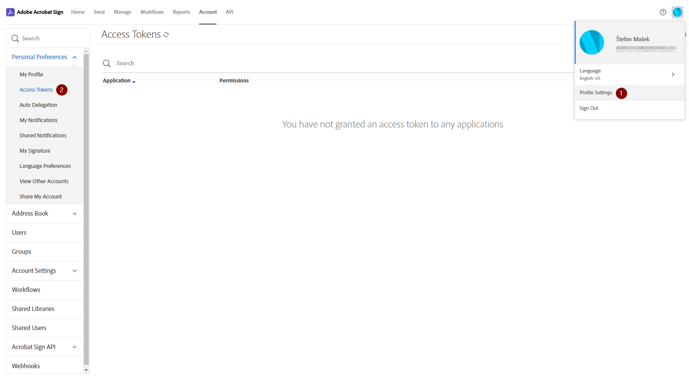
 3. Erstelle einen neuen Integrationsschlüssel!
    [create-integration-key](images/integrationKey2.png)
 4. Kopiere den Integrationsschlüssel auf die Admin-Setup-Seite
    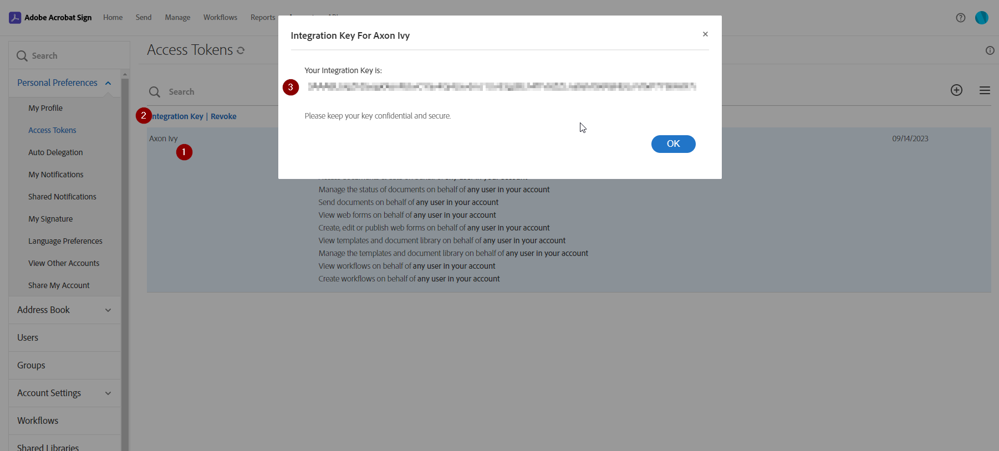

#### Oauth
Adobe API doc Referenzen für OAuth
 1. https://secure.adobesign.com/public/static/oauthDoc.jsp
 2. https://opensource.adobe.com/acrobat-sign/developer_guide/oauth.html

##### OAuth-API-Anwendung einrichten
Eine API-Anwendung muss im Adobe Sign-Administratorkonto eingerichtet werden,
bevor OAuth im Konnektor konfiguriert werden kann.
 1. Geh zu Ihrer Adobe Sign-Kontoseite: https://secure.adobesign.com/account/
 2. Geh zu „ **“ (API-Anwendungen) und konfiguriere„** “ (API-Anwendungen).
    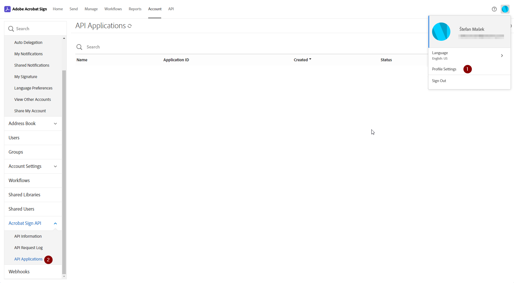
 3. Erstelle eine neue API-Anwendung. Lege den Namen, den Anzeigenamen und die
    Domäne fest! [new-application](images/oauth2.png)
 4. Öffne die neu erstellte Anwendung und kopiere die ID und das Passwort auf
    die Seite „Admin Setup” (Admin-Einrichtung) des Konnektors. a. Anwendungs-ID
    = `adobeAcrobatSignConnector.clientId` b. Passwort =
    `adobeAcrobatSignConnector.clientSecret`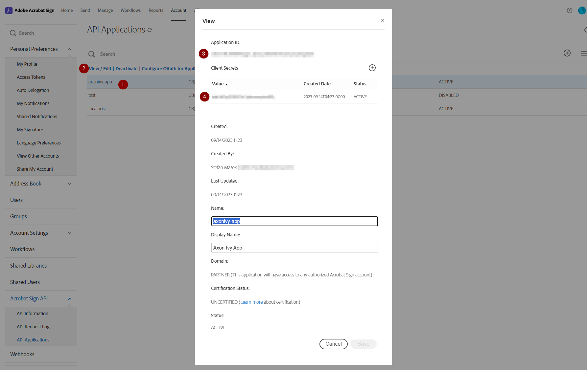
5. Öffne **Konfigurieren Sie OAuth für Ihre Anwendung** a. Kopiere **Redirect
   URI** aus der Admin-Einrichtungsseite des Konnektors und fügen ihn in die
   Anwendungskonfiguration ein. b. Aktiviere die Berechtigungen, die von dieser
   Anwendung angefordert werden können. 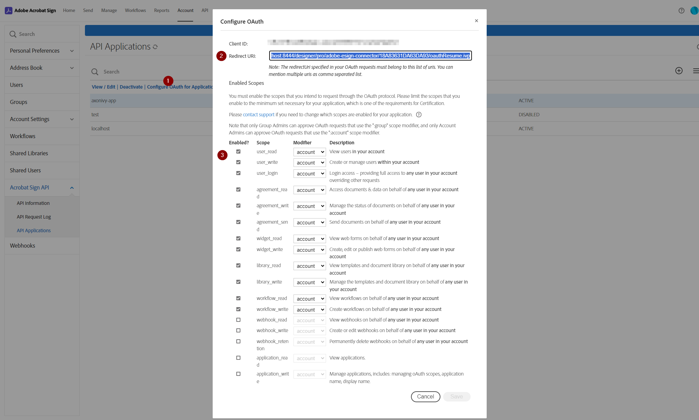

##### Variablen und Admin-Einrichtungsseite für OAuth-Beschreibung
| Variablen Name                              | Beschreibung                                                                                                                                                                                                                                                        | Beispiel                                                                                                                                                                                                                                                         |
| ------------------------------------------- | ------------------------------------------------------------------------------------------------------------------------------------------------------------------------------------------------------------------------------------------------------------------- | ---------------------------------------------------------------------------------------------------------------------------------------------------------------------------------------------------------------------------------------------------------------- |
| adobeAcrobatSignConnector.baseUri           | Basis-URI zum Abrufen der Zugriffs- und Aktualisierungszugriffstoken (ohne den Teil `/token` oder `/refresh` )                                                                                                                                                      | `https://api.eu2.adobesign.com/oauth/v2`                                                                                                                                                                                                                         |
| adobeAcrobatSignConnector.authenticationUri | URL für die Autorisierungsanfrage (:exclamation:unterscheidet sich von der Token-URL)                                                                                                                                                                               | `https://secure.eu2.adobesign.com/public/oauth/v2`                                                                                                                                                                                                               |
| adobeAcrobatSignConnector.clientId          | Adobe API-Anwendungs-Client-ID                                                                                                                                                                                                                                      |                                                                                                                                                                                                                                                                  |
| adobeAcrobatSignConnector.clientSecret      | Adobe API-Anwendungs Client Passwort                                                                                                                                                                                                                                |                                                                                                                                                                                                                                                                  |
| adobeAcrobatSignConnector.permissions       | Liste der Berechtigungen, die für das OAuth-Token angefordert werden                                                                                                                                                                                                | `user_read:account user_write:account user_login:account agreement_read:account agreement_write:account agreement_send:account widget_read:account widget_write:account library_read:account library_write:account workflow_read:account workflow_write:account` |
| adobeAcrobatSignConnector.oauthToken        | Informationen zum OAuth-Aktualisierungstoken. Leer bedeutet, dass kein Token initialisiert wurde. Um ein neues Token anzufordern, verwende die Schaltfläche „ `“ (Aktualisierungstoken speichern und anfordern) „` “ (Aktualisierungstoken speichern und anfordern) |                                                                                                                                                                                                                                                                  |
| adobeAcrobatSignConnector.accessToken       | Informationen zum OAuth-Zugriffstoken.                                                                                                                                                                                                                              |                                                                                                                                                                                                                                                                  |
| Weiterleitungs-URI                          | Diese URI muss lediglich in der API-Anwendung auf der Adobe Sign-Kontoseite eingerichtet werden. (Siehe **OAuth API Application Setup** )                                                                                                                           | `https://localhost:8444/designer/pro/adobe-acrobat-sign-connector/18A83631DA63DA93/oauthResume.ivp`                                                                                                                                                              |

##### Anforderung eines OAuth-Tokens
:exclamation::exclamation::exclamation: Bitte konfigurieren alle Variablen im
Abschnitt „OAuth” auf der Seite „Admin-Einstellungen” (siehe vorheriger
Abschnitt), da diese für die Anforderung des Tokens erforderlich sind.

 1. Klicke auf die Schaltfläche „ `“ (Speichern und neues Token anfordern)`.
    Wenn die Konfiguration der Variablen korrekt ist, wirst Du zur Anmeldeseite
    von Adobe Sign weitergeleitet.
    
2. Melde Dich mit Deinem Adobe Sign-Konto an!
   [adobe-login](images/tokenRequest2.png)
3. Nach erfolgreicher Anmeldung solltest Du alle angeforderten Berechtigungen
   sehen. Klicke auf „ **“ (Zugriff gewähren) „** “ (Zugriff gewähren).
   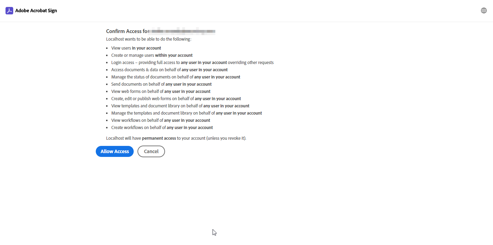
4. Das Token wird abgerufen und Du solltest zurück zur Admin-Einrichtungsseite
   des Konnektors weitergeleitet werden, wo Du das initialisierte Token sehen
   kannst. 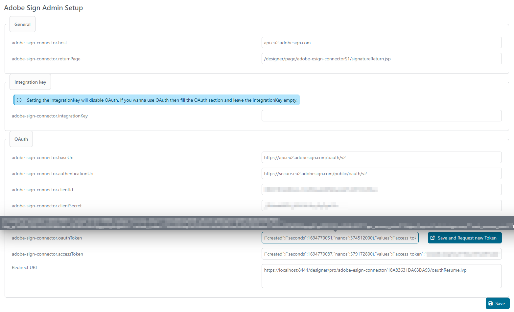

> [!HINWEIS] Der Pfad zur Variablen `adobe-acrobat-sign-connector` wird ab der
> Ivy-Version 13.x in `adobeAcrobatSignConnector` umbenannt.
