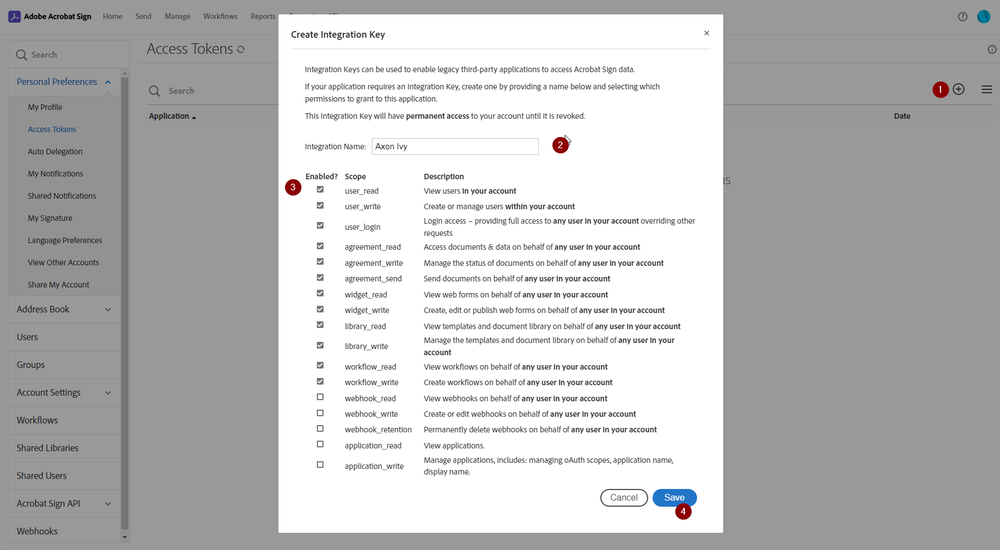
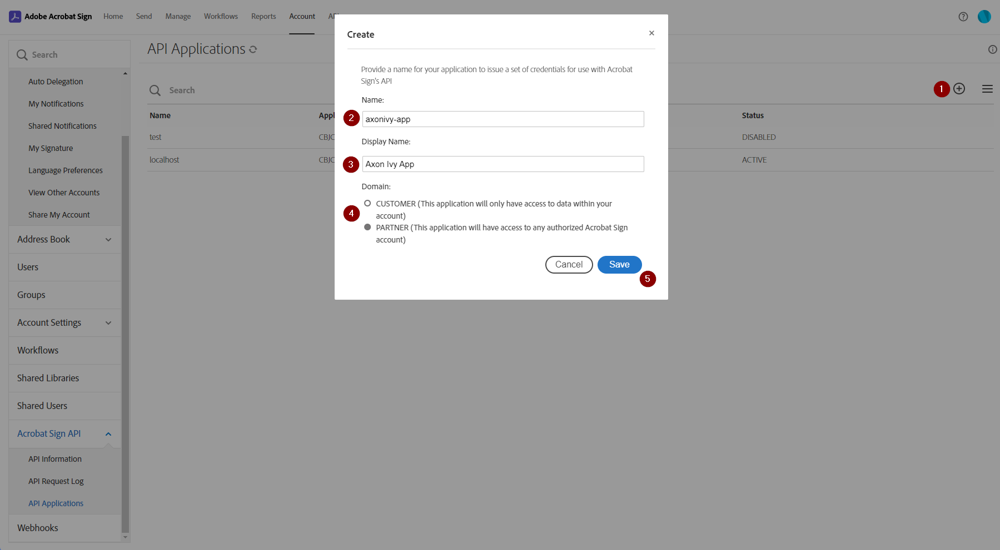
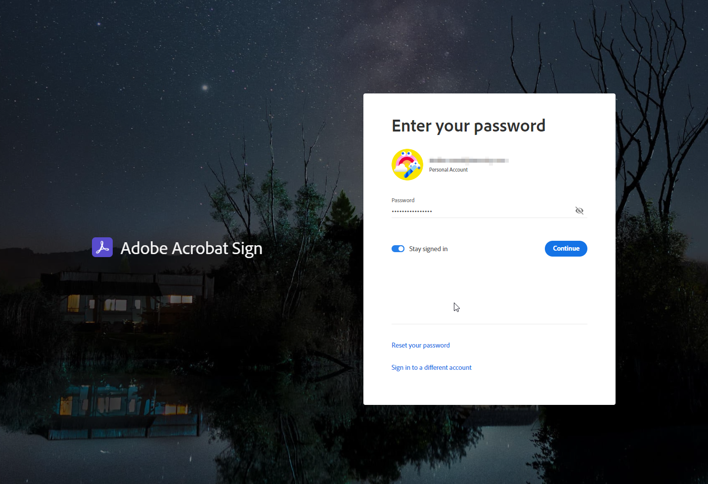

# Adobe Acrobat Sign Konnektor

[Adobe Signieren](https://www.adobe.com/sign.html) ist eine Wolke-basisbezogene
elektronische Unterschrift Bedienung aktiviert jener Nutzer zu senden, Indiz,
Fährte, und fertigbringen Unterschrift workflows digital. Mit das Adobe Akrobat
Indiz Anschluss, du kannst diese Aufgaben integrieren füglich und #unkompliziert
verarbeitet hinein eure #Axon #Ivy.

Dieser Anschluss:
- Versieht #offene Quelle #kodieren also kannst sicher du integrieren Adobe
  Akrobaten Indiz hinein euren #Axon Efeu Ausführungen
- Beglaubigt mit OAuth2 oder einen Integration Schlüssel
- Erlaubt du zu #hochladen #PDF(s) jener ist signiert bei #man oder #mehrere
  Personen

## Demo

Das Demo Projekt kann sein benutzt zu testen die Authentifizierung und
signierend und die Demo Ausführung kann sein benutzt wie Eingebung für
Entwicklung.

### Wie zu signieren ein Dokument in den Demo Antrag
:Ausruf: Die Demo will arbeiten nur nach richtig Einrichtung von dem Anschluss
(Kontrolle Deckel "Einrichtung") 
 1. Wähl aus und #hochladen eins oder #mehr #PDF Dateien
 2. Betritt #Email von 1 oder 2 #Unterfertigter
 3. Bekomm Abkommen für die #Unterfertigter
 4. Indiz wie #Unterfertigter 1 und (ob konfiguriert) #Unterfertigter 2
 5. Eine Zwiegespräch Schachtel mit die Adobe Unterschrift Seite öffnet. Schaff
    eine Unterschrift in dem Dokument. Ob #mehrere Dokumente haben gewesen
    #herbeirufen signieren, sie sind alle hier gezeigt und können sein signiert
    in #man schreitet.

 7. Bestätig die Unterschrift mit **Klickt zu Signieren**.

 7. Die #mit Vorzeichen versehen Dokumente können sein heruntergeladen gesondert
    oder da einem verbundenen Dokument.

## Einrichtung

### Adobe Indiz Konto Kreation

    An Adobe Sign account needs to be created to setup and use the connector.

  1. Schaff ein **AdobeSign** Gesellschaft **Konto** ODER für Entwickler Konto
     Kreation Nutzung [Schafft Entwickler Konto, APIs für #benutzerdefiniert
     Anträge | Akrobat Indiz](https://www.adobe.com/sign/developer-form.html)
     und folgen diese Stufen:

     Ein. Setz ein die Form mit persönlich und #dienstlich #Daten + dauert fort
     

     b. Versieh ein Passwort + dauert fort
     

     c. Versieh Datum von Geburt + dauert fort
     

     d. Du willst empfangen keinen Verifikation Code. Betritt den Code und den
     Arbeitsgang wollen fortdauern automatisch
     

     e. Entwickler Konto ist geschafft
     

Adobe Indiz versieht 2 Optionen für Authentifizierung. (Sieht Einrichtung
Sektion)

 1. Integration Schlüssel
 2. OAuth2

Zu Einrichtung und benutzen die Adobe Indiz Anschluss braucht es zu sein
gekoppelt mit Adobe. Ein Adobe Administration Konto Notwendigkeiten zu sein
geschafft. (Sehen Adobe Indiz Konto Kreation)

### Admin Einrichtung Seite
Adobe Indiz Anschluss versieht eine Einrichtung Seite für leicht Einrichtung von
dem Anschluss und Einrichtung von der Authentifizierung. Zu können öffnen das
admin Einrichtung Seite die admin Nutzer Notwendigkeiten zu besitzen
`ADOBE_ESIGN_ADMIN` Rolle #welche ist Teil von dem Anschluss.

#### Allgemein
| Variabler Name                       | Steckbrief                                                    |
| ------------------------------------ | ------------------------------------------------------------- |
| adobeAcrobatSignConnector.Gastgeber  | hostname Von Adobe Indiz Server                               |
| adobeAcrobatSignConnector.returnPage | Bezüglicher Teil von URL jener heißt nach #sengen war beendet |

#### Integration Schlüssel
:Ausruf: Ob der Integration Schlüssel ist gesetzt, OAuth ist #deaktivieren für
den Anschluss. Ob du möchtest benutzen OAuth für den Anschluss, verlass den
Integration Schlüssel leert aus :Ausruf:
| Variabler Name                           | Steckbrief                                          |
| ---------------------------------------- | --------------------------------------------------- |
| adobeAcrobatSignConnector.integrationKey | Integration Schlüssel von Adobe Indiz Konfiguration |

##### Wie zu bekommen einen Integration Schlüssel

 1. Geh zu eure Adobe Indiz Konto Seite: Https://Befestig.adobesign.com/Konto/
 2. Öffne **Zugang Automatenmünzen** Konfiguration
    
 3. Schaff neuen Integration Schlüssel
    
 4. Kopier den Integration Schlüssel zu den admin Einrichtung Seite
    

#### Oauth
Adobe API doc Verweise für OAuth
 1. Https://Befestig.adobesign.com/Öffentliche/Statik/oauthDoc.jsp
 2. Https://opensource.adobe.com/Akrobat-Indiz/Entwickler_steuert/oauth.html

##### OAuth API Antrag Einrichtung
Ein API Antrag Notwendigkeiten zu sein Einrichtung an Adobe Signiert admin
verrechnet bevor OAuth kann sein konfiguriert in dem Anschluss.
 1. Geh zu eure Adobe Indiz Konto Seite: Https://Befestig.adobesign.com/Konto/
 2. Geh zu **API Anträge** Konfiguration 
 3. Schaff neu API Antrag. Setz den Namen, Display Name und Domäne
    
 4. Öffne den neulich geschaffenen Antrag und kopieren ID und Geheim zu dem
    Anschluss Admin Einrichtung Seite eine. Antrag ID =
    `adobeAcrobatSignConnector.clientId` b. Kunde Geheimnis =
    `adobeAcrobatSignConnector.clientSecret` 
5. Öffne **Konfigurieren OAuth für Antrag** für euren Antrag einen. Kopie
   **Leitet um URI** von Anschlusss Admin Einrichtung Seite und #bekleben ihm zu
   die Antrag Konfiguration b. Aktivier persmissions jener kann sein
   aufgefordert von diesem Antrag 

##### Variablen und Admin Einrichtung Seite für OAuth Steckbrief
| Variabler Name                              | Steckbrief                                                                                                                                                                                                        | Beispiel                                                                                                                                                                                                                                                      |
| ------------------------------------------- | ----------------------------------------------------------------------------------------------------------------------------------------------------------------------------------------------------------------- | ------------------------------------------------------------------------------------------------------------------------------------------------------------------------------------------------------------------------------------------------------------- |
| adobeAcrobatSignConnector.baseUri           | Gründe URI für bekommen den Zugang und erfrischen Zugang Automatenmünzen (#ohne die `/Automatenmünze` oder `/erfrischt` Teil)                                                                                     | `Https://api.eu2.adobesign.com/oauth/v2`                                                                                                                                                                                                                      |
| adobeAcrobatSignConnector.authenticationUri | URL Für die Berechtigung Bitte (:Ausruf:Weicht ab von Automatenmünzen URL)                                                                                                                                        | `Https://Befestig.eu2.adobesign.com/Öffentlich/oauth/v2`                                                                                                                                                                                                      |
| adobeAcrobatSignConnector.clientId          | Adobe API Antrag Kunde ID                                                                                                                                                                                         |                                                                                                                                                                                                                                                               |
| adobeAcrobatSignConnector.clientSecret      | Adobe API Antrag Kunde Geheimnis                                                                                                                                                                                  |                                                                                                                                                                                                                                                               |
| adobeAcrobatSignConnector.Erlaubnisse       | Liste von Erlaubnisse will jener sein aufgefordert für die OAuth Automatenmünze                                                                                                                                   | `Nutzer_las:Konto Nutzer_schreibt:Konto Nutzer_Anmeldung:Konto Abkommen_las:Konto Abkommen_schreibt:Konto Abkommen_sendet:Konto Ding_las:Konto Ding_schreibt:Konto Bibliothek_las:Konto Bibliothek_schreibt:Konto workflow_las:Konto workflow_schreibt:Konto` |
| adobeAcrobatSignConnector.oauthToken        | Info Etwa das OAuth erfrischt Automatenmünze. Leeres Mittel ist dort keine Automatenmünze initialisierte. Zu auffordern eine neue Automatenmünze Nutzung die `Speichert und Auffordern neue Automatenmünze` Knopf |                                                                                                                                                                                                                                                               |
| adobeAcrobatSignConnector.accessToken       | Info Etwa das OAuth Zugang Automatenmünze.                                                                                                                                                                        |                                                                                                                                                                                                                                                               |
| Leite um URI                                | Dies URI einfache Notwendigkeiten zu sein Einrichtung zu die API Antrag an Adobe Indiz Konto Seite. (Sehen **OAuth API Antrag Einrichtung** Sektion)                                                              | `Https://localhost:8444/Designer/pro/adobe-Akrobat-Indiz-Anschluss/18A83631DA63DA93/oauthResume.ivp`                                                                                                                                                          |

##### #Auffordern OAuth Automatenmünze
:Ausruf::Ausruf::Ausruf: Bitte #konfigurieren alle die Variablen herein OAuth
Sektion weiter die Admin Einrichtung Seite (sieht vorausgehende Sektion) da sie
sind nötig für #auffordern die Automatenmünze.

 1. Klick das `Speichern und Auffordern neue Automatenmünze` Knopf. Du willst
    sein umgeleitet zu Adobe Indiz Anmeldung Seite ob die Konfiguration von den
    Variablen sind #berichtigen.
    
2. Anmeldung mit eure Adobe Indiz Konto
   
3. Nach erfolgreich Anmeldung solltest du sehen alle die #angefordert
   Erlaubnisse. Klick **Erlaubt Zugang**.
   
4. Die Automatenmünze will sein wiedergewonnen und du solltest sein umgeleitet
   zurück zu dem Anschluss Admin Einrichtung Seite und sollte können sehen die
   initialisiert Automatenmünze. 

> [!BEACHTE] Den variablen Pfad `adobe-Akrobaten-Indiz-Anschluss` ist
> #umbenennen zu `adobeAcrobatSignConnector` von 13.
